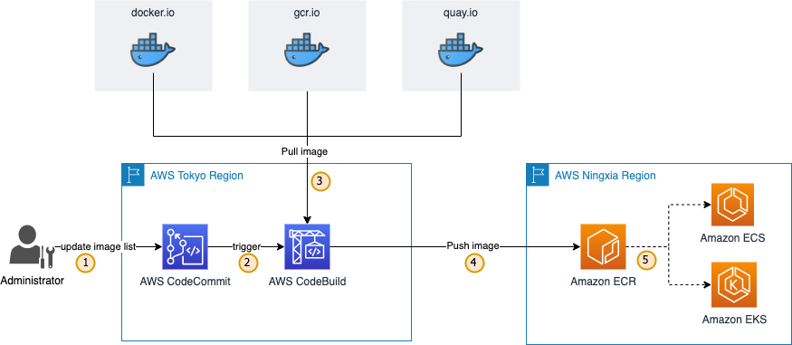

# Public container images mirror solution

In the container community, most public container images are located in Docker Hub, Quay, and GCR. In order to get fast, stable, and secure access to these public images from Amazon ECS or EKS, it's recommended to replicate these images to Amazon ECR. There are 2 use cases to have replicated public container images in your private ECR container registry:
1. Replicate frequently used container images into ECR to get fast and stable access in conatiner platform.
2. Due to security and compliance consideration, you may need to have your ECS/EKS cluster in subnet without Internet access and use VPC PrivateLink to get access to ECR.

This solution is intended to demostrate an automated process to replicate public conatiner images into ECR by submitting your needed images list into AWS CodeCommit repository:

## How It Works



1. The administrator will modify the required image path and its tag to images.txt and submit it to the AWS CodeCommit repository.
2. According to the preconfigured trigger rules, AWS CodeCommit will trigger AWS CodeBuild to start the build task.
3. The AWS CodeBuild build task pulls these images from the public image repository based on the image list in images.txt.
4. The AWS CodeBuild build task tags these images to make them point to the target ECR repository and then pushes these images to ECR repository.
5. Container management platforms such as Amazon ECS or EKS pull these images from the local ECR repository to run the containers.


## How to Deploy

You may deploy this solution with AWS CDK to any AWS region.

1. Please follow [Getting started with the AWS CDK](https://docs.aws.amazon.com/cdk/latest/guide/getting_started.html) to install AWS CLI, Node.js, and other tools.

2. Get access key ID (AK) and secret key (SK) for an AWS IAM user who has push/pull access to target ECR repository.

3. Clone this project and install required npm modules

```bash
$ git clone https://github.com/aws-samples/amazon-ecr-replication-for-pub-container-images.git
$ cd amazon-ecr-replication-for-pub-container-images
$ npm install
```

4. Deploy this solution with Amaozn ECR of another AWS account and region, replace targetRegion, targetRegionAK, and targetRegionSK with the region and IAM user credential.

```bash
$ npx cdk deploy --parameters targetRegion=cn-northwest-1 --parameters targetRegionAK=AKABCD12345 --parameters targetRegionSK=SK12345
```

5. Check out and commit the images.txt file into the CodeCommit repository. You may notice the images will be replicated to your ECR repository in the target AWS account.

## How to Destroy the Stack

```bash
$ npx cdk destroy
```

## Security

See [CONTRIBUTING](CONTRIBUTING.md#security-issue-notifications) for more information.

## License

This library is licensed under the MIT-0 License. See the LICENSE file.
